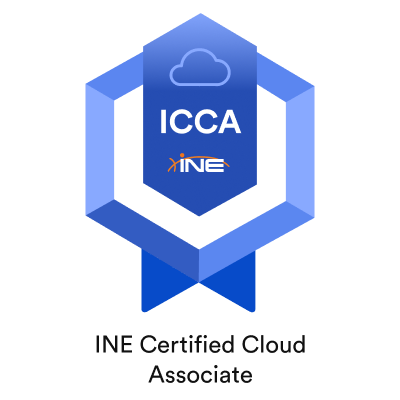

# Portfolio 
## Welcome to my portfolio! My name is Brian Kesselly and I am a recent graduate from the cybersecurity engineering program from the Flatiron School. I am excited to showcase my skills and projects to potential employers.

# Skills
###### Proficiency in Python, Javascript, Solidity

<b>Experience with networking protocols and tools (e.g. TCP/IP, Wireshark). <b/>  
 
<b>Knowledge of cybersecurity best practices and frameworks (e.g. NIST, ISO 27001). <b/>  
 
<b>Strong analytical and problem-solving skills. <b/>  
 
## Projects
[Password Generator](https://github.com/bkesselly/Portfolio/tree/main/Password%20Generator) : A simple Python script (CLI & GUI) for generating random passwords of various lengths.  
 
[Hashcat Password Cracking](https://github.com/bkesselly/Portfolio/blob/main/Cracking%20PWs%20with%20Hashcat/Hashcat_Lab.md) : A simple tutorial on how to crack passwords with Hashcat.  
 
Port Scanner : A Python script using the nmap library to scan a target IP address for open ports.  
 
Encryption/Decryption Tool : A Java program for encrypting and decrypting files using the AES algorithm.  
 
[Soc+ Honeynet in Azure](https://github.com/bkesselly/Portfolio/tree/main/SOC%20%2B%20Honeynet%20in%20Azure) : A honeynet in Azure that ingest log sources from various resources into a Log Analytics workspace, which is then used by Microsoft Sentinel to build attack maps, trigger alerts, and create incidents.   
 
Flatiron Hacktember 2023: Part of a team that built a web application that helped children with disabilities learn different languages and was awarded "Most Polished" (Look and feel is virtually market-ready) after the event.
 
## Education
### Certificate in Cybersecurity Engineering, Flatiron School (2022)
### Bachelor's Degree in Criminal Justice, University of Cincinnati (2021)

## Certifications
#### CompTIA Network+ 
#### CompTIA Security+ 
#### CompTIA A+ 
#### LPI Linux Essentials 
#### ITIL v4 Foundation 
#### Blue Team Level 1 (BTL1), Security Blue Team	
#### ICCA - INE Certified Cloud Associate	
#### eLearnSecurity Junior Penetration Tester 
#### Google IT Support 
 

## Contact
#### Feel free to contact me for more information or to discuss potential job opportunities.

##### Email: brian.kesselly@gmail.com
##### LinkedIn: www.linkedin.com/in/brian-kesselly
 
<b>Thank you for considering me for your team!</b>

